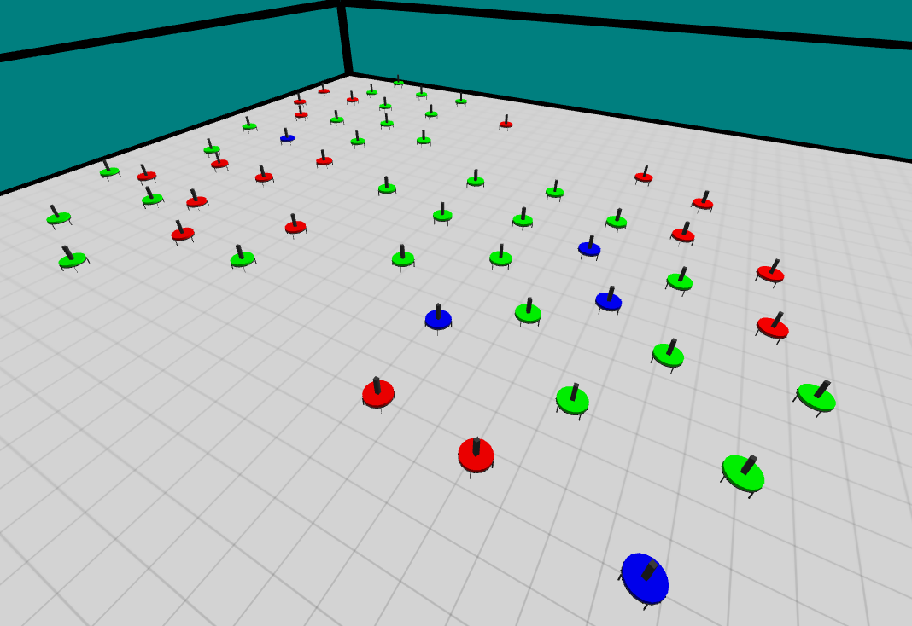

**Table of Contents** 

- [swarm-apocalypse](#swarm-apocalypse)
    - [Introduction](#introduction)
    - [Installation of ArgoS Simulator:](#installation-of-argos-simulator)
    - [Complation of Swarm Apocalypse](#complation-of-swarm-apocalypse)
    - [Running the Default Swarm Apocalypse Experiments:](#running-the-default-swarm-apocalypse-experiments)
      - [Experiment #1:](#experiment-1)
      - [Experiment #2:](#experiment-2)
      - [Experiment #3:](#experiment-3)
      - [Experiment #4:](#experiment-4)
      - [Experiment #5:](#experiment-5)
      - [Experiment #6:](#experiment-6)
      - [Experiment #7:](#experiment-7)
      - [Experiment #8:](#experiment-8)
    - [Generating New Experiments with New Configuration](#generating-new-experiments-with-new-configuration)
    - [Running the Generated Experiments](#running-the-generated-experiments)
    - [Publications](#publications)


# swarm-apocalypse



<!-- ### Experiments Simulation Videos

link : https://www.youtube.com/playlist?list=PL0cxiXoTD1yrCu7D6G-pZHdq5ZTmW2N8q -->

### Introduction 

**What this project about ?**

The swarm takes off where every agent has to reach some fixed altitude of 3 meters before they can flock together. Initially, a percentage of the population is randomly selected to be infected and a number of medic agents are inserted in the swarm. We randomly distribute 50 normal agents and a variable number of medics in an area of size 360 meter square with an aim to reach the target position with minimum agents losses.we color-code the types of agents for improved visualization and future qualitative assessment.

**Agents Behavior in Simulation**
After taking off, the agents start to form a cluster of inter-connected agents. Then the swarm starts to perform flocking to a certain target. 

Health status is published to the swarm but bounded by communication range.

Agent encounter system failure as a result of infection and fall to the ground when time exceeds $t_{symI}$ without being cured by any nearby available medic agent.

The medic agents can be in two states, free and busy. When they are in the free state, they can start to cure infected agents. Medics are busy when they are in the process of curing infected agents and it takes $t_{cure}$ to fully cure an infected agent.

During curing time both medics and infected become stationary within the curing zone while publishing their status to nearby swarm agents. 

Once the curing time is out, medic agent change status from busy back to free and the cured agent change from infected to healthy.
The swarm objective is to flock together and move in a cluster towards a given direction. 


### Installation of ArgoS Simulator:
Refer to [ArgoS Installation]([experiments](https://www.argos-sim.info/user_manual.php)) for binary and source installation.
Once you tested the ArgoS simulator with any example you're ready to go to the next phase.

### Complation of Swarm Apocalypse
1. open up a shell, go to the argos directory and clone this repo:
    ```sh
    $ cd ~/argos3
    $ git clone https://github.com/mohamedelsayed95/swarm-apocalypse.git
    ```
2. go to the swarm_pocalypse directory 
    ```sh
    $ cd ~/argos3
    ```
    ```sh
    $ mkdir build
    $ cd build
    ```
    **Note:** if build directory exists after clone the repo delete it first then ceate the new one.
<br />

3. To produce debuggable code (slow), type:
    ```
    $ cmake -DCMAKE_BUILD_TYPE=Debug ..
    ```
    To produce fast but not debuggable code, type:
    ```
    $ cmake -DCMAKE_BUILD_TYPE=Release ..
    ```
    Finally, launch the compilation with the command:
    ```
    $ make
    ```
    If you find no error, you're ready to go to the next phase.


### Running the Default Swarm Apocalypse Experiments:

In this package you'll find some basic simulation to start using ARGoS.

To run an experiment with ARGoS, you need to define two things:
1. the robot controllers
2. the experiment configuration

You find example controllers in the ``controllers/`` directory. The
experiment configuration files are located in the experiments/
directory.
To run an example, the configuration files have been written with the
hypothesis that you run them in the directory where you unpacked the
tar.bz2, NOT in the build/ directory. Therefore, go to that directory
normaly is ``/home/argos/swarm_apocalypse`` and type:

```
$ argos3 -c experiments/{Name_of_Exp}.argos
```
example: 
```
$ argos3 -c experiments/ex1_eyebot_apocalypse_healthy_only_reach_target.argos
```

#### Experiment #1:
In this experiment, we experiment with only healthy agents. The target of the experiment is to test the eyebots quadcoptars healthy_only_reach_target no other agents

#### Experiment #2:
In this experiment, we experiment with only healthy and infected agents. The target of the experiment is to test the interaction between them. Different parameters are considered in this experiment such as symptoms infection time, terminal infection time, infection distance, and population infection percentage.


#### Experiment #3:
In this experiment, we experiment with medic, healthy, and infected agents. The target of the experiment is to test the effect of adding medics on the population and how to make them survive. Different parameters are considered such as curing distance and curing time.

#### Experiment #4:

#### Experiment #5:

#### Experiment #6:

#### Experiment #7:

#### Experiment #8:

### Generating New Experiments with New Configuration 

**We provide python script to automatically generate any number experiments with any parameters.**
 1. change diractory 
    ```sh
    $ cd ~/argos3/swarm-apocalypse/experiments
    ```
 2. open the script with any editor and follow its instruction
    ```sh
    $ gedit experiments-generator.py
    ```
### Running the Generated Experiments

 1. run the script
    ```sh
    $ python experiments-generator.py
    ```
 2. after running the script you will have new folder in ```swarm-apocalypse/experiments``` directory contain all your new experiments and 3 shell scripts generated at ```swarm-apocalypse``` directory.You can run each experiments indvitualy or all togather and collect the results:
* **Run Only one experiment**:
    ```sh 
    $ argos3 -c experiments/{experiments_generated_folder_name}/{name_of_your_experiments}.argos
    ```
    **Note** by defualt experiments is headless to see simulation enviroment in an ArgoS GUI uncomment  ```</visualization>``` tag in the .argos file of your experiment
    <br/>
* **Run All experiments**:
    ```sh
    $ sh run_all_experiments.sh
    ```
    **Note** :all experiments is running headless now and you should monitor your results updated in ```swarm-apocalypse/generated_experiments_results``` directory.
    To kill all experiments:
    ```sh
    $ cd ~/argos3/swarm-apocalypse
    ```
    ```sh
    $ sh kill_all_experiments.sh
    ```
3. If you are not satisfy with the resulats or want to delete all generated experment and its results:
    ```sh
    $ sh delete_all_experiments.sh
    ```
    **Note:** Experiments files,folders you generated and all changes you made it is now deleted.

### Publications
*   [Decentralised Control of Malware Infection Dissemination in Autonomous Agent Swarm Systems]()

